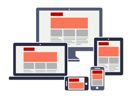

# Responsiveness Project

In this project I created a responsive portfolio which includes a home page, a contact page, and a portfolio page.&nbsp; I got to utilize media screen tags on my html pages to make them viewable on different devices.&nbsp; The viewport meta tag is included on each html page to ensure this.&nbsp;The buttons on the navbar make it easy to navigate from one page to the next.&nbsp;   Certain elements of the page are the same which gives continuity to the portfolio.
 
 

